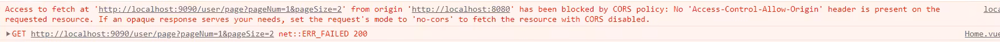

# 项目介绍

B站springboot和Vue前后端分离项目，学生管理系统

# 开发环境

1、springboot2.7.0

2、Vue3

3、maven3.6.3

4、mysql6

5、element plus

# 遇到问题汇总

1、用ref封装的数据需要用value取到

```js
let isCollapse = ref(false);
  let sideWidth = ref(200);
  let logoTextShow = ref(true);
  let iconName = shallowRef(Fold);
```

2、mapper.xml文件扫描配置

```yaml
mybatis:
  mapper-locations: classpath:mapper/*.xml #扫描所有mybatis的所有xml文件
  configuration:
    log-impl: org.apache.ibatis.logging.stdout.StdOutImpl
```

3、前后端跨域问题解决



解决方法：https://blog.csdn.net/qq_39390545/article/details/106615075

4、忽略某个字段，不展示给前端

```java
//不展示密码
@JsonIgnore
private String password;
```

5、vue3实现数组响应式

```js
//方法一
let tableData = ref([])
//取数据需要.value
tableData.value = res.data;
//方法二
2.使用reactive，
let list = reactive({arr: [xx,xx,xx]});
list.arr //使用方式
```

6、分页模糊查询

一、使用mybatis，使用sql语句实现

二、使用mybatis-plus实现

引入依赖

安装分页插件

7、集成swaggerUI

代替postman进行接口测试

8、axios发送ajax请求

安装axios

配置封装axios

request.js

```js
import axios from 'axios'

const request = axios.create({
    baseURL: '/api',
    timeout: 5000
})

//拦截器
//添加一个请求拦截器
axios.interceptors.request.use(config => {
    //config.headers.languagetype = 'CN'; // 举例，加上一个公共头部
    //config.data = Qs.stringify(config.data); // 处理数据，可不写
    return config;
  },
  err => {
    return Promise.reject(err);
  });

//添加一个响应拦截器
axios.interceptors.response.use(res => {
  //在这里对返回的数据进行处理
  console.log(res.data, '网络正常');
  return res.data;
}, err => {
  console.log('网络开了小差！请重试...');
  return Promise.reject(err);
})

export default request 
```

全局引入

```js
import request from '@/utils/request'
app.config.globalProperties.$request = request;
```

使用

```js
import {getCurrentInstance} from 'vue'
const currentInstance = getCurrentInstance()
const {$request} = currentInstance.appContext.config.globalProperties;

$request.get("/user/page",{
        params: {
          pageNum: currentPage.value,
          pageSize: pageSize.value,
          username: username.value,
          email: email.value,
          address: address.value
        }
    }).then(res =>res.data)
      .then(res =>{
        // console.log(res)
        // console.log(username)
        tableData.value = res.records;
        total.value = res.total;
    })
```

9、Vue使用路由

